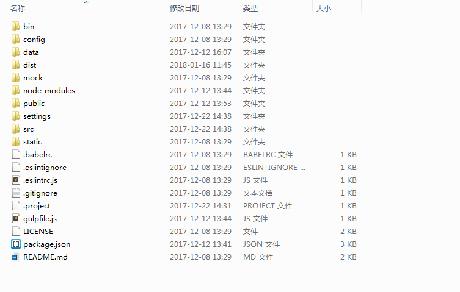

# 开发环境搭建

1. 安装node.js (官网：https://nodejs.org/en/)

2. 利用淘宝npm镜像安装相关依赖
    1. 在cmd里面直接输入： npm install -g cnpm --registry=https://registry.npm.taobao.org  
  淘宝镜像地址： http://npm.taobao.org/ 

  

3. 获取开发框架

4. 安装依赖包
    1. cd切换到项目目录
    2. 在cmd中输入cnpm install (安装时间会比较长，请保证网络稳定,若安装失败请直接删除目录下的node_modules文件夹或执行cnpm uninstall删除安装的依赖再重新执行命令)
    
    安装后的文件目录为

    

5. 测试环境是否成功
    1. 在cmd中输入npm run dev 控制台未报错且浏览器中页面正常显示即项目运行成功

