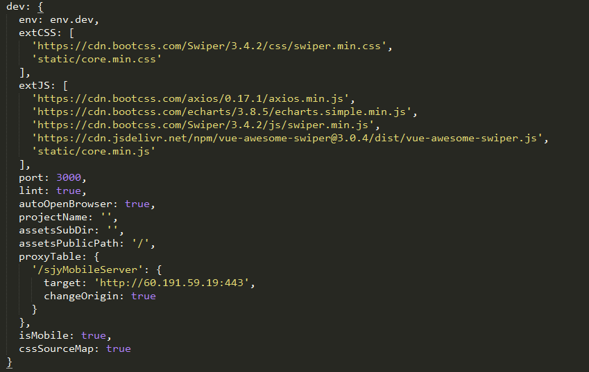
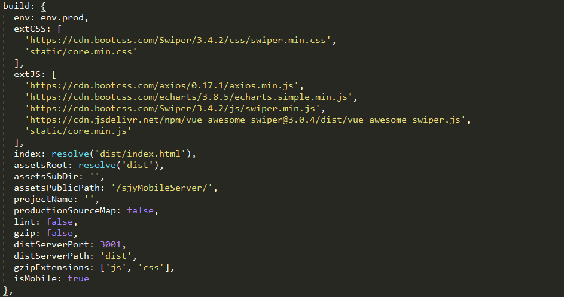
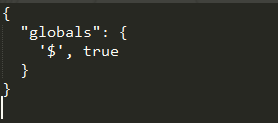

# 开发环境搭建

1. 安装node.js (官网：https://nodejs.org/en/)

2. 由于npm仓库是国外服务器这里推荐利用淘宝npm镜像安装相关依赖。淘宝镜像地址： http://npm.taobao.org/ 
    1. 在cmd里面直接输入： npm install -g cnpm --registry=https://registry.npm.taobao.org  

    

3. 获取开发框架

4. 安装依赖包
    1. cd切换到项目目录
    2. 在cmd中输入cnpm install (如果出现安装失败的情况，建议将项目目录文件夹中的node_modules文件夹删除后，重新运行 cnpm install 命令进行安装，确保所有依赖包能够一次性安装成功。)
    
    

    安装完成之后，会在我们的项目目录文件夹中多出一个node_modules文件夹，这里边就是我们项目需要的依赖包资源。

    安装后的文件目录为：
    

5. 修改一些基本配置
    配置文件目录（settings下的core.js）：
    

    配置文件分为两部分，dev开发模式，build生产模式

> #### dev中的参数如下：

> 

| 属性 | 含义 | 值 | 建议 |
| ---|:---:|:---:|:---:|
| extCSS | 外部css地址(主要为第三方样式文件) | '' | 根据需要自动设置cdn外联样式 |
| extJS | 外部js地址(比如echart，axios等第三方库) | '' | 根据需要自动设置cdn外联样式 |
| port | 端口 | 5000 | 根据需要自动设置 |
| autoOpenBrowser | 是否自动打开浏览器 | true | 不建议 |
| projectName | 浏览器中的显示名 | '' | 根据需要自动设置 |
| assetsSubDir | 静态资源放在文件夹 | 'static' | 根据需要自动设置 |
| assetsPublicPath | 发布路径 | '' | 根据需要自动设置 |
| proxyTable | 代理配置表,在这里可以配置特定的请求代理到对应的API接口 | '/sjyMobileServer/' | 按后台接口更改 |
| isMobile | 是否是移动端 | true | 按需求更改 |
| cssSourceMap | 是否开启cssSourceMap | true | 不建议 |

> #### build中的参数如下：

> 

| 属性 | 含义 | 值 | 建议 |
| ---|:---:|:---:|:---:|
| extCSS | 外部css地址(主要为第三方样式文件) | '' | 根据需要自动设置cdn外联样式 |
| extJS | 外部js地址(比如echart，axios等第三方库) | '' | 根据需要自动设置cdn外联样式 |
| index | html入口文件 | path.resolve(__dirname, '../dist/index.html') | 不建议 |
| assetsRoot | 产品文件的存放路径 | path.resolve(__dirname, '../dist') | 不建议 |
| assetsSubDir | 静态资源放在文件夹 | 'static' | 根据需要自动设置 |
| assetsPublicPath | 发布路径 | '' | 根据需要自动设置 |
| projectName | 浏览器中的显示名 | '' | 根据需要自动设置 |
| productionSourceMap | 是否使用source-map | false | 不建议 |
| lint | 是否开启语法验证 | true | 不建议 |
| gzip | 是否开启gzip压缩 | false | 不建议 |
| isMobile | 是否是移动端 | true | 按需求更改 |

> 当引入外部js时，比如引入jquery时，在extJS中设置jquery的cdn地址如图：

> 

> 如果我们不配做.eslintrc文件直接在vue文件中使用$这页面会提示错误如图:

> 

> 当我们在src目录下新建.eslintrc文件配置globals属性为{$: true}后页面运行成功,$不在提示错误。配置如下：

> 

> 图片的配置

> 设置图片的大小，当小于设置值时，图片会被转成base64在也页面中显示。配置文件在config文件夹中的webpack.base.js中：

> 

> 文件夹别名配置
> 设置文件夹的别名。配置文件在config文件夹中的webpack.base.js中：

> 
> 设置别名后，引用方式进行修改有原先的import 'src/api/Home/api'调整为import '@/api/Home/api'。

### 完成基本配置和依赖安装后测试环境是否成功
> 在cmd中输入npm run dev 控制台未报错且浏览器中页面正常显示即项目运行成功
    
