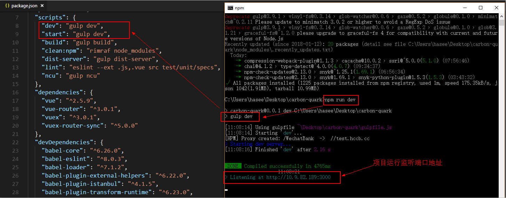
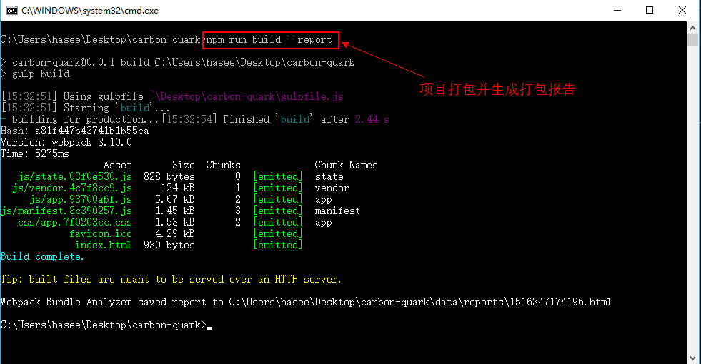
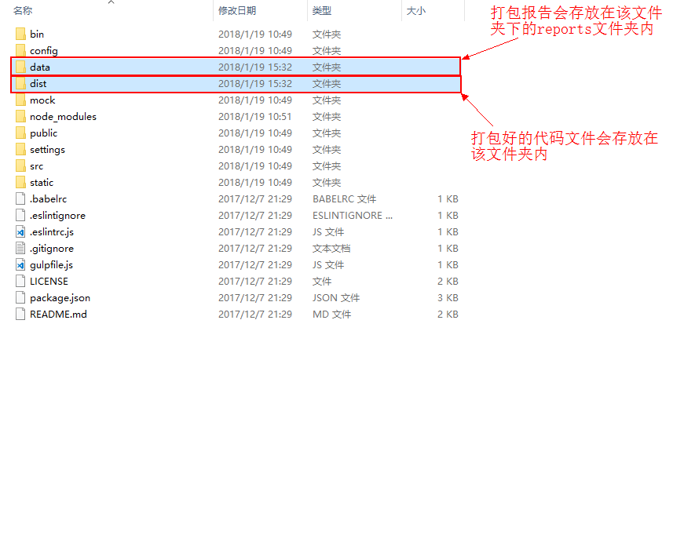
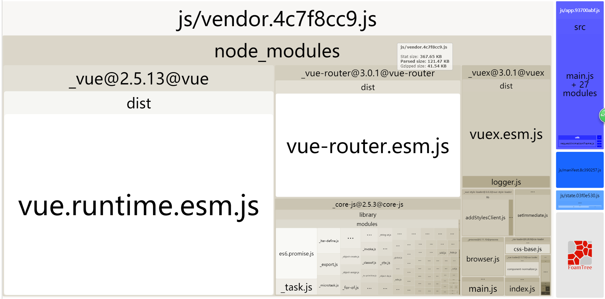

# 3.NPM基本开发命令行操作

## npm run dev
进入到项目目录文件夹，运行命令行工具，运行命令 npm run dev 或 npm run start ，会用热加载的方式运行我们的应用，热加载可以让我们在修改完代码后不用手动刷新浏览器就能实时看到修改后的效果。

这里简单介绍下 npm run dev 命令，其中的“run”对应的是package.json文件中scripts字段中的dev，也就是 gulp dev 命令的一个快捷方式。

项目运行成功后，浏览器会自动打开监听的端口地址，（如果浏览器没有自动打开，可以根据终端显示结果手动输入）。接下来我们就可在开发环境中进行基础的开发工作了。

## npm run build
开发工作完成后，接下来就可以将测试通过的工程代码进行编译、打包和发布了。
在项目目录中，运行命令 npm run build --report ，可以将整个项目根据我们配置好的打包机制进行打包，并生成打包报告。

打包完成后在项目目录文件夹下会多出两个文件夹 data 与 dist ，打包生成的报告会存放在 data 文件夹下的 reports 子文件夹内。而打包生成的所有代码文件（包括HTML、CSS、JS文件）会存放在dist文件夹内。

生成的打包报告可以看到项目中所有资源所占的比重，可以以此进行后期页面优化处理。

