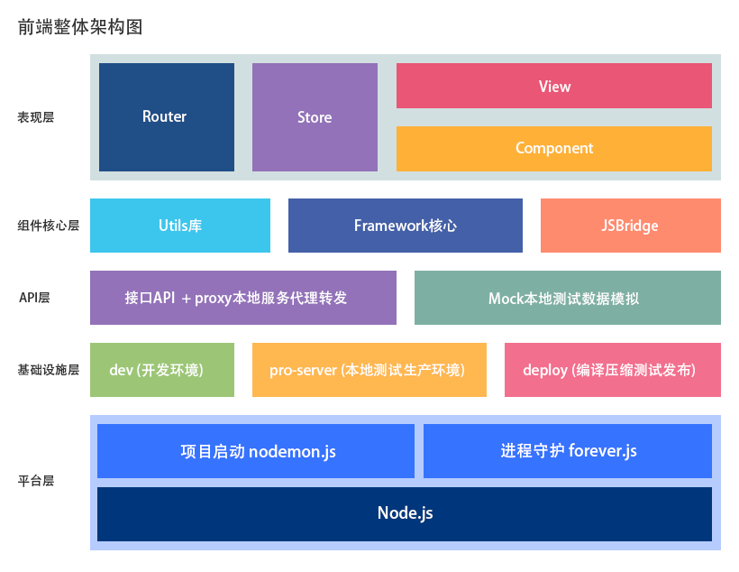

# 基本介绍

## （一）前言

众所周知，Vue.js是近几年国内最流行的前端框架之一。我们也顺应趋势，基于Vue.js推出了新一代的移动前端开发框架。

得益于Vue.js完善的社区及核心团队，我们可以根据官方团队的指导和建议，在应用框架中集成了Vuex、Vue-Router、Axios等成熟的组件库。围绕着Vue.js为核心，我们选取部分官方核心组件并针对实际项目需求定制了整套完善的组件库，完美符合应用中常用交互、状态管理、数据请求等开发中常见的需求场景。

该框架的业务开发工作需要运行在Node.js平台上，通过Webpack实现前端项目的开发、编译、打包等工作。有别于其他的普通Vue.js项目，我们针对实际工程和项目需求，深度定制了一整套完整的Webpack开发配置，不仅实现了开发环境的模块热替换、热重载，以及生产打包的Bundle模块分析、体积优化等基础功能，为了降低配置上手难度，我们还将核心配置提炼成一个简单的配置文件，使各位开发者只需专注于业务的开发。

## （二）优势

> Vue.js 作为后起之秀，没有其他大型框架的历史包袱，也没有其他框架设计时的历史遗留问题，作者尤雨溪大刀阔斧地将浏览器的兼容标准提高到了ie8+，并向最新的ECMAScript标准看齐，虽然没有突破性的创新设计，但是将框架的易用性、标准性提高到了一个较高的水准，解决了很多前端开发过程中的痛点。

基于Vue.js优秀的设计，以及ECMAScript的事实标准，我们开发了一套完善的前端开发框架，其具有如下优势：

- 开发配置简易化
- 编译速度更快
- 工程架构更合理
- 组件低耦合高内聚
- 完善的开发流程配置

### 与其他框架横向比对
| 指标 | Vue.js 2.0+ | React.js 16.0+ | Angular.js 4.0+ |
|--------|:------:|:------:|:------:|
| 项目核心脚本体积 | 较小 | 一般 | 较大 |
| 学习曲线 | 平缓 | 陡峭 | 陡峭 |
| 国内社区活跃度 | 非常活跃 | 较活跃 | 一般 |
| 开发效率 | 非常高 | 较高 | 较高 |

## （三）架构图谱

在工程层面，我们综合了市面上几种比较典型的项目架构，实现了一套成熟的工程项目案例。（见下图）

